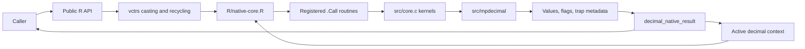

# Architecture

## Overview

`decimal` provides immutable, arbitrary-precision decimal vectors for R.
The R layer owns vector semantics, scale, context state, and conditions. The C
layer performs exact parsing and vectorized numerical work through
`mpdecimal`. User-visible values never hold native pointers.

## Runtime Flow

## Components

| Component | Location | Key symbols |
| --- | --- | --- |
| Values and methods | `R/decimal.R` | `decimal()`, `new_decimal()`, `vec_arith.decimal()`, `vec_math.decimal()` |
| Context state | `R/context.R` | `decimal_context()`, `get_decimal_context()`, `decimal_update_flags()` |
| Native adapter | `R/native-core.R` | `decimal_context_call()`, `decimal_native_result()` |
| Native kernels | `src/core.c` | `decimal_c_*_strings()`, parsing and result helpers |
| Routine registration | `src/init.c` | `CallEntries`, `R_init_decimal()` |
| Runtime validation | `R/zzz.R`, `R/mpdecimal-version.R` | `.onLoad()`, `decimal_runtime_smoke_test()` |
| Arithmetic engine | `src/mpdecimal/` | Vendored libmpdec 4.0.1 |

## Data Flows

### Construction

`decimal()` dispatches through `as_decimal()`. Character values are
canonicalized natively and R infers or validates one shared scale. Promotion
to a finer scale is exact padding under a context-free native kernel;
reduction to a coarser scale is quantized under the active context. Integer
construction is exact. Double conversion decodes the IEEE 754 value exactly
in C and requires an explicit or configured scale before quantization.

### Arithmetic

R methods reject unsupported implicit casts, recycle operands with `vctrs`,
and send equal-length character vectors plus the active context to C. Each C
kernel checks interrupts, parses elements into temporary `mpd_t` values, calls
a quiet `mpd_q*` operation, formats the result, and aggregates status bits.
`decimal_native_result()` updates sticky flags, raises a classed error for the
first trapped element, and otherwise reports unexpected signals as warnings.

### Equality and Ordering

Comparison operators call native `mpdecimal` comparison directly. Equality and
ordering proxies use normalized native keys, avoiding lossy conversion through
double while retaining normal `vctrs` matching and sorting behavior.

## Boundaries

- R owns missing-value propagation, type compatibility, vector recycling, and
  the session-scoped context.
- C owns exact conversion, numerical operations, native allocation cleanup,
  and status aggregation.
- `src/mpdecimal/` is an upstream dependency, not first-party feature code.
- Generated API documentation and the rendered README are build artifacts.
